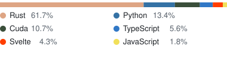

<picture>
  <source media="(prefers-color-scheme: dark)" srcset="graph-dark.svg">
  <source media="(prefers-color-scheme: light)" srcset="graph-light.svg">
  
</picture>

#### [LumenLLM](https://github.com/Vemloir/LumenLLM)

**Rust + CUDA** inference engine for NVIDIA Blackwell (SM120), built to run 35B-class MoE models on a single **16 GB** GPU. Native NVFP4/FP8, hand-written kernels, explicit VRAM/RAM placement per component. On an RTX 5070 Ti it **beats vLLM** on decode and prefill for models that fit — and runs several vLLM OOMs on outright.

#### [Varmlen](https://github.com/Vemloir/Varmlen-Client-Linux)

Open-source **xray-core** VPN clients ([Linux](https://github.com/Vemloir/Varmlen-Client-Linux) · [Windows](https://github.com/Vemloir/Varmlen-Client-Windows) · [Android](https://github.com/Vemloir/Varmlen-Client-Android)) with per-app/per-domain split tunneling, built on Tauri 2 + SvelteKit.

#### [Aegis VPN](https://github.com/Vemloir/AegisVPN)

Production VPN subscription platform on **Xray (VLESS + Reality)** and **Hysteria2**, live at [aegisvpn.org](https://aegisvpn.org). Every node pulls signed config over outbound HTTPS and reconciles itself — **no inbound port open** on any exit server.

 

<picture>
  <source media="(prefers-color-scheme: dark)" srcset="languages-dark.svg">
  <source media="(prefers-color-scheme: light)" srcset="languages-light.svg">
  
</picture>
